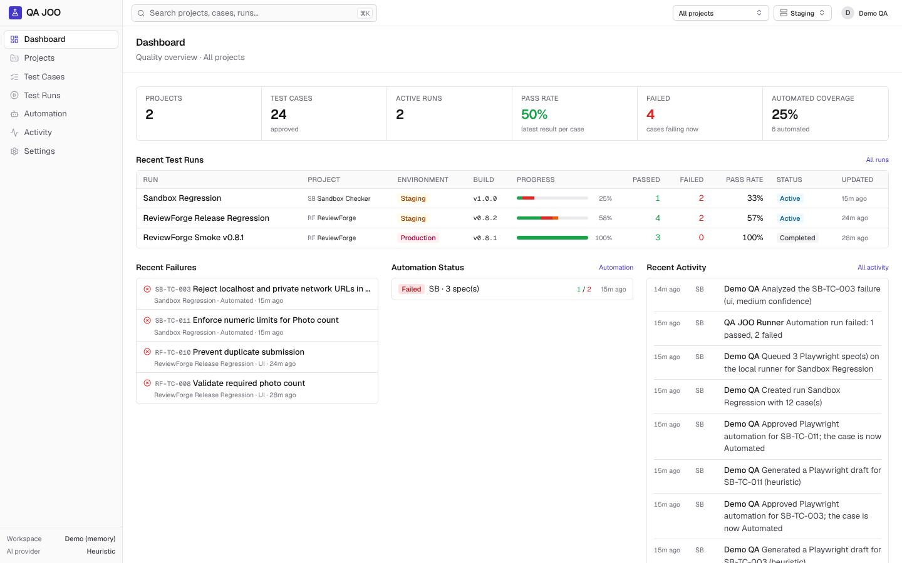
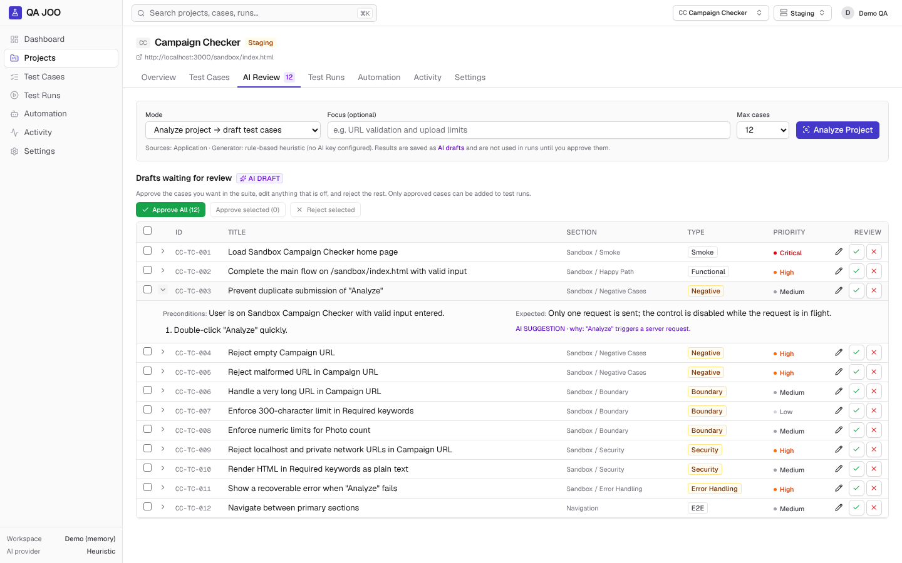
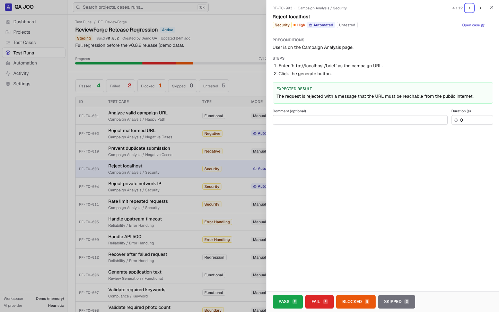
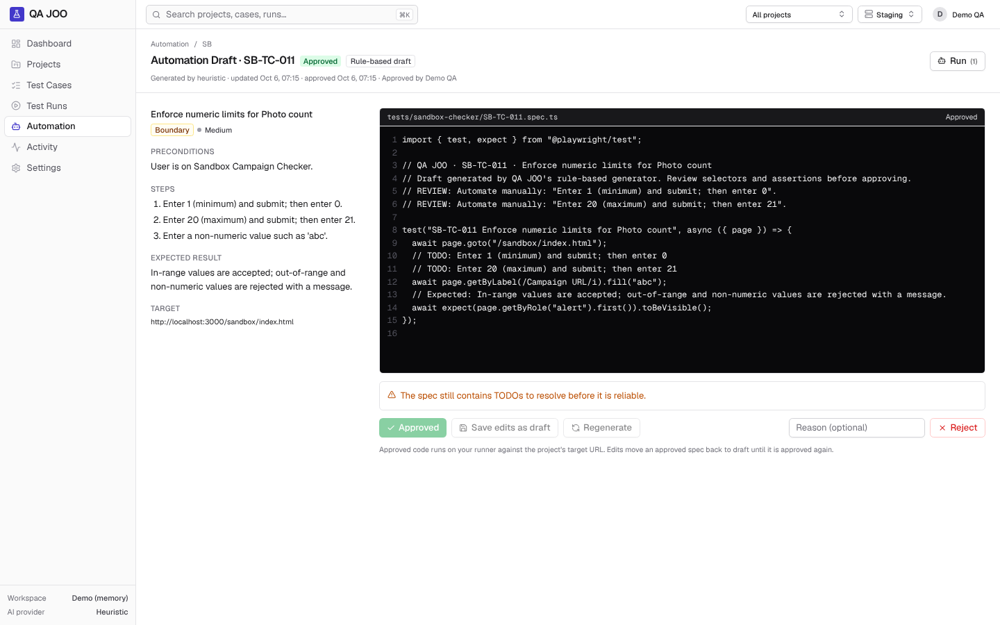
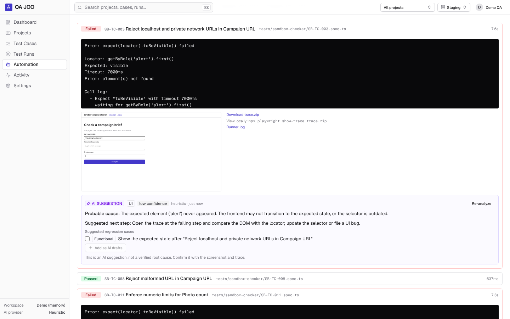
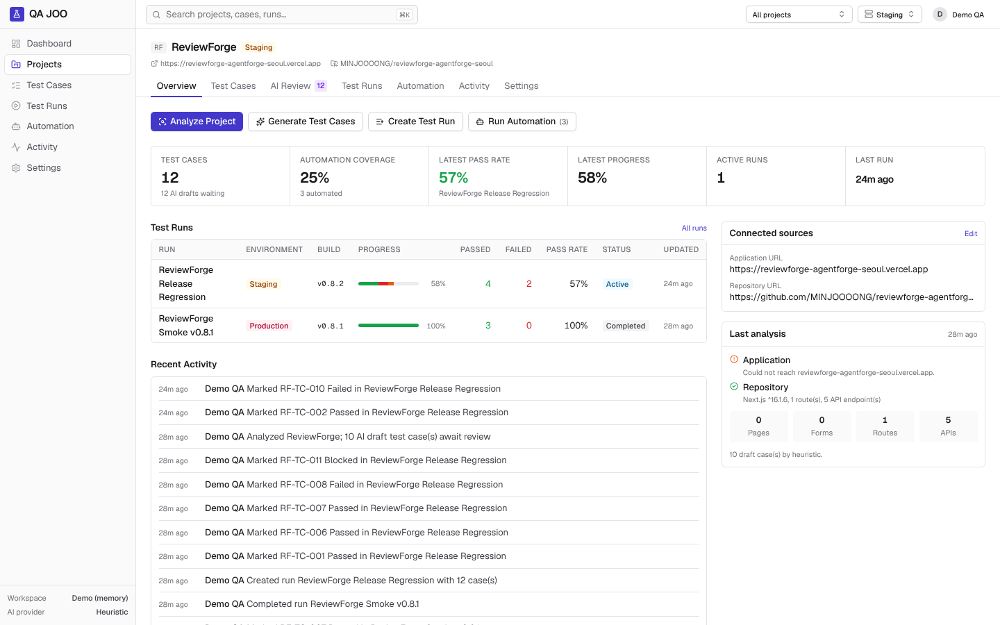

# QA JOO

AI-assisted test management and QA automation platform.

[](https://github.com/MINJOOOONG/qa-joo/actions/workflows/ci.yml)
[](https://github.com/MINJOOOONG/qa-joo/actions/workflows/e2e.yml)

**TestRail-style test management + AI test case generation + Playwright automation**, in one workflow:

> Paste a URL → QA JOO analyzes the app → AI drafts test cases → a human reviews them → run them manually or with Playwright → screenshots, traces and AI failure triage come back to the same run.



## Table of contents

- [Overview](#overview)
- [Why I Built It](#why-i-built-it)
- [Core Features](#core-features)
- [Architecture](#architecture)
- [Manual QA Flow](#manual-qa-flow)
- [Automated QA Flow](#automated-qa-flow)
- [AI-assisted Test Generation](#ai-assisted-test-generation)
- [Playwright Integration](#playwright-integration)
- [GitHub Actions Integration](#github-actions-integration)
- [Database](#database)
- [Local Setup](#local-setup)
- [Environment Variables](#environment-variables)
- [Testing](#testing)
- [Security](#security)
- [Screenshots](#screenshots)
- [Roadmap](#roadmap)

## Overview

QA JOO is a test management tool for QA engineers who also automate. It keeps the familiar
TestRail model (projects → sections → test cases → test runs → results) and adds three things
that usually live in separate tools:

1. **Project analysis** – connect a live application URL and/or a public GitHub repository;
   QA JOO crawls pages, forms, inputs, buttons, routes and API endpoints.
2. **AI test case generation** – an LLM (Anthropic or OpenAI) or a deterministic rule-based
   generator drafts functional, negative, boundary, security and error-handling cases. Every
   generated case is an **AI Draft** until a human approves it.
3. **Playwright automation** – any approved case can get an AI-drafted Playwright spec. After code
   review and approval, specs run on a separate runner (local CLI or GitHub Actions) and report
   pass/fail, duration, screenshot, trace and log back into the same test run as manual results.

The three flows the product is optimized for:

| Flow | Path |
|---|---|
| 1 · Start a suite | New Project → paste URL → Analyze → review AI drafts → Approve All / Edit → Create Test Run |
| 2 · Manual QA | Test Run → open a case → read steps → **PASS** → next untested case opens automatically |
| 3 · Automated QA | Automated case → Run → Playwright executes → PASS/FAIL recorded → open failure → screenshot / trace / AI analysis |

## Why I Built It

Test management tools are good at recording results but do not help with the slowest parts of
QA: writing the first version of a test suite for a new feature, and turning manual cases into
reliable automation. AI can help with both, but only if a human stays in control: generated tests
need review, generated code must not run unreviewed, and failure analysis is a hypothesis, not a
verdict.

QA JOO is my answer to that: a working test management tool where AI drafts and suggests, people
approve, and Playwright does the repetitive execution. It is also a portfolio project, so the
codebase aims to show how I approach architecture, testing, security and CI.

## Core Features

Implemented features are listed here; unbuilt work is under [Roadmap](#roadmap). Items marked
*(untested)* are implemented but not covered by automated tests in this repository yet.

| Area | Implemented |
|---|---|
| Workspace | Sidebar app shell, global search (⌘K), current-project switcher, default environment, activity log |
| Projects | Create / edit / delete (with key confirmation), Application URL and/or GitHub repository, environment, overview KPIs |
| Analysis | HTTP crawler (up to 5 same-origin pages), public GitHub repository reader (README, routes, API endpoints, key files), SSRF protection; optional Playwright-rendered mode for client-side apps |
| AI test cases | Anthropic / OpenAI / rule-based generators, guaranteed negative / boundary / security / error coverage, dedupe against the existing suite, "suggest missing regression cases" mode |
| Review gate | AI Draft status, approve / edit / reject per case, Approve All / selected, `AI GENERATED` and `AI SUGGESTION` badges with the reason behind each case |
| Test cases | Dense table with filters (project, section, type, priority, automation, last result, source, review) and search, detail drawer and page, edit, duplicate, delete, add to run, execution history |
| Sections | Hierarchical sections, rename, delete (cases move up a level) |
| Test runs | Create from all / filtered (section subtree, type, priority, automation) / hand-picked cases, progress bar, pass rate, result summary filters, complete / reopen (completed runs are read-only) |
| Manual execution | Execution drawer with preconditions / steps / expected result, PASS · FAIL · BLOCKED · SKIPPED (keyboard P/F/B/S, J/K), auto-advance, timed duration, failure category + severity + actual result + evidence URLs |
| Automation | AI Playwright drafts, code review editor with static safety lint, approve / save / reject / regenerate, per-spec and per-run execution, cancel |
| Runner | Local runner (spawned by QA JOO) and GitHub Actions runner, HMAC-signed manifest / results / artifact upload, screenshots, traces, logs |
| Failure analysis | Probable cause, category, confidence, next step and suggested regression cases (AI or rule-based), one click to add suggestions as AI drafts |
| Dashboard | Projects, test cases, active runs, pass rate, failed, automation coverage, recent runs, recent failures, automation status, activity |
| Data | Supabase (PostgreSQL) with RLS, or an in-memory store persisted to a JSON file for local use; demo seed |
| Auth | Supabase Auth email/password sign-in when Supabase is configured *(untested)*; single local user otherwise |
| CI | Lint, typecheck, unit tests, build, migration check, repository contract tests on PostgREST, Playwright E2E |

## Architecture

### Product flow

```text
Project URL / Repository
          ↓
     QA JOO Analyzer
          ↓
      AI Test Cases
          ↓
      Human Review
          ↓
       Test Suite
        ↙      ↘
   Manual QA   Automated QA
                  ↓
              Playwright
                  ↓
           Target Application
                  ↓
        Screenshot / Trace
                  ↓
             QA JOO
                  ↓
          Failure Analysis
                  ↓
            Human Review
```

### System

```text
┌──────────────────────────── Next.js 16 (App Router) ────────────────────────────┐
│  UI (Server Components + client islands, Tailwind, shadcn/ui-style components)  │
│  Server Actions ─┐                     Route Handlers (/api/...)                │
│                  ▼                               │                              │
│            Services (lib/services) ◄─────────────┘   business rules, state      │
│               │        │        │                    machine, review gates      │
│        Repository   Analyzer   AI provider                                      │
│   (memory | Supabase) (SSRF-safe fetch,  (Anthropic SDK | OpenAI | heuristic)   │
│                        GitHub REST API)                                         │
└───────┬───────────────────────────────────────────────────────▲─────────────────┘
        │ Postgres (Supabase)                                     │ HMAC-signed
        ▼                                                         │ manifest / results / artifacts
   projects, sections, test_cases, ...                    ┌──────┴───────────────┐
                                                          │ Runner (npm run       │
                                                          │ qa:runner): local     │
                                                          │ process or GitHub     │
                                                          │ Actions job           │
                                                          └──────┬───────────────┘
                                                                 │ Playwright
                                                                 ▼
                                                        Target application
```

Key decisions:

- **Runner outside the web app.** Playwright never runs inside a serverless request. QA JOO queues
  an automation run; a runner (local CLI or GitHub Actions) pulls an HMAC-signed manifest of
  *approved* specs, executes them, uploads artifacts and posts results back.
- **Human-in-the-loop by construction.** AI cases are stored as `draft` and cannot be added to runs
  (enforced in the service layer, with a database constraint that drafts must be AI-generated).
  Playwright code becomes runnable only after approval, and approval is blocked while the static
  lint reports errors.
- **One repository interface, two stores.** `MemoryRepository` (demo / local / unit tests) and
  `SupabaseRepository` implement the same interface and pass the same contract test suite; CI
  runs that suite against PostgREST, the data API Supabase uses.
- **Every AI feature has a deterministic fallback.** Without an API key the rule-based generators
  still produce grounded output (and the UI says so), which also keeps tests deterministic.

### Code layout

```text
src/
  app/(app)/          pages: dashboard, projects, cases, runs, automation, activity, settings
  app/api/            route handlers: analyze, automation (generate/runs/results/artifacts), search
  app/actions/        server actions for forms
  components/         ui/ (shadcn-style primitives), shell/, cases/, runs/, automation/, review/
  lib/domain/         types, constants, Zod schemas, run stats, result state machine, sections
  lib/services/       projects, sections, cases, runs, results, analysis, automation, dashboard
  lib/db/             repository interface, memory + Supabase implementations, demo seed
  lib/analyzer/       HTML parser, app crawler, GitHub repository reader, secret redaction
  lib/ai/             provider interface, Anthropic/OpenAI, generators, failure analyzer
  lib/automation/     runner HMAC auth, report parser, code lint, artifacts, dispatch
  lib/security/       URL guard (SSRF) and safe fetch
  proxy.ts            Supabase session refresh + sign-in redirect (Next.js 16 "proxy")
runner/qa-runner.ts   Playwright runner CLI
supabase/migrations/  schema, constraints, RLS, storage bucket
e2e/                  QA JOO's own Playwright tests
public/sandbox/       fixture app used by self-tests and demos
```

## Manual QA Flow

1. **Create a run** – pick the project, environment (Local / Development / Staging / Production),
   build/version and the cases: all, a filter (sections include sub-sections, type, priority,
   automation status) or a hand-picked list. Only approved cases are eligible.
2. **Execute** – click a row to open the execution drawer. It shows preconditions, steps and the
   expected result, and times how long you spend on the case.
3. **Record** – PASS / FAIL / BLOCKED / SKIPPED (or P / F / B / S). PASS and SKIPPED save
   immediately and jump to the next untested case. FAIL asks for failure category (UI, API,
   Backend, Data, Network, Environment, Automation Script, Unknown), severity and actual result,
   plus optional evidence URLs (screenshot, trace, log, network log). BLOCKED asks for a reason.
4. **Track** – the header shows progress and pass rate; the summary chips filter the table.
   Completing a run makes it read-only until it is reopened.

Result rules (enforced in `lib/domain/result-rules.ts`, the services and the database):

- one result per (run, case); re-testing updates it and increments `attempts`
- results only for cases that belong to the run (composite foreign key)
- completed runs are locked; "reset to untested" requires an existing result
- an automated result never overwrites a manual verdict recorded after the automation run started
- pass rate = passed / (passed + failed + blocked); skipped cases are excluded

## Automated QA Flow

```text
Approved case ──Generate Automation──▶ Playwright draft ──review / edit──▶ Approve
                                                                              │
Test run "Run Automated Tests" / project "Run Automation" / spec "Run" ◄──────┘
        │  POST /api/automation/runs  → automation_run (queued)
        ▼
Dispatch: local runner process │ GitHub workflow_dispatch │ external (CLI)
        │
Runner ── GET  /api/automation/runs/:id/manifest   (signed)  approved specs only
       ── POST /api/automation/results {running}   (signed)
       ── npx playwright test  (screenshot + trace on failure)
       ── POST /api/automation/artifacts            (signed)  screenshots, traces, logs
       ── POST /api/automation/results {passed|failed, results[]} (signed)
        │
QA JOO stores automation_results and mirrors each verdict into the test run (mode = Automated)
        │
Failure → screenshot inline, trace download / Trace Viewer, runner log → Analyze Failure
```

Automation runs move `queued → running → passed | failed | cancelled`; finished runs are immutable,
so a replayed callback is rejected. Required API surface:

| Endpoint | Auth | Purpose |
|---|---|---|
| `POST /api/automation/generate` | session | Test case → Playwright draft |
| `POST /api/automation/runs` | session, or runner signature for `github` / `scheduled` triggers | Create an automation run |
| `GET /api/automation/runs/:id` | session | Run status, results and summary |
| `POST /api/automation/results` | runner signature | Store runner results |
| `GET /api/automation/runs/:id/manifest` | runner signature | Approved specs for a run |
| `POST /api/automation/artifacts` | runner signature | Upload screenshot / trace / log |
| `POST /api/automation/results/:id/analyze` | session | AI failure analysis |

## AI-assisted Test Generation

**Inputs.** The analyzer builds a compact, size-bounded summary:

- *Application URL*: titles, headings, navigation, buttons, forms and inputs with labels,
  placeholders and constraints (`required`, `type=url`, `maxlength`, `min`/`max`, `accept`, …),
  internal links, and a warning for client-rendered pages (set `ANALYZER_BROWSER=true` to render
  them with Playwright).
- *Repository URL* (public GitHub only): README, framework, Next.js routes and API endpoints from
  the file tree, components, up to 8 key source files (API handlers, schemas, pages) and derived
  hints (rate limiting, timeouts, URL validation, uploads…). Private repositories are refused;
  `.env`, key and credential files are never fetched, and secrets are redacted from everything
  that is stored or sent to a model.

**Providers.** `AI_PROVIDER=anthropic|openai|heuristic` (auto-detected from the available key).
The interface is intentionally small: *"return JSON that matches this Zod schema"*.

- Anthropic uses the official `@anthropic-ai/sdk` with structured outputs
  (`output_config.format`), `claude-opus-5-5` by default, and opts into server-side refusal
  fallbacks (`fallbacks: "default"`).
- OpenAI uses Chat Completions with a JSON-schema response format.
- Without a key, rule-based generators produce cases from the analysis signals and the UI labels
  the provider as *heuristic*.

The LLM integrations are implemented against the official SDK / API, but this repository's tests
do not call live models: they use the rule-based generators and mocked providers. Configure a key
to use them.

**Guarantees.** Output is normalized and validated again by QA JOO; duplicates of existing cases
are dropped; at least 40 % of cases are negative / boundary / security / error, and each of those
types is topped up from the rule-based generator when the model omits it. Analysis content is
passed as untrusted data and the prompts instruct the model to ignore instructions inside it.

**Where AI is used**: project analysis → test case drafts, missing regression case suggestions,
Playwright drafts, failure triage, and regression cases suggested from a failure. AI output is
always shown as `AI GENERATED` / `AI SUGGESTION` and never changes the suite or runs code on its own.

## Playwright Integration

- Approved specs are stored in the database and materialized by the runner as
  `tests/<project-slug>/<CASE-KEY>.spec.ts` (e.g. `tests/reviewforge/RF-TC-002.spec.ts`) inside an
  isolated workspace `.qa-joo-runs/<runId>/`. Paths are validated to prevent traversal.
- Specs use origin-relative paths; the runner sets `baseURL` to the origin of the run's target URL.
- Failure artifacts: `screenshot: only-on-failure`, `trace: retain-on-failure`, plus the Playwright
  log. They are uploaded to QA JOO (local disk, or a private Supabase Storage bucket *(untested)*)
  and served via `/api/artifacts/...` to signed-in users only, with a sandboxing CSP.
- The static lint (`lib/automation/code-lint.ts`) blocks approval of specs that import anything
  besides `@playwright/test`, use dynamic `import()`, `fs`, `child_process`, `eval` or `test.only`,
  or reference `process`, `globalThis`, `global`, `require`, `module`, `Function`, `constructor` or
  `__proto__` (comments and string contents are ignored, but those names as string keys are
  blocked too). It warns about `waitForTimeout`, TODOs and missing assertions.
- The lint is a review aid, **not a sandbox**: approved specs run as ordinary Node code on the
  runner. The runner limits the damage by starting Playwright with a minimal environment (no
  `RUNNER_CALLBACK_SECRET` or other credentials) and the local dispatcher passes the runner only
  the variables it needs. Run automation on a disposable runner (e.g. GitHub Actions) and approve
  only specs you have read.
- Each case maps to one spec file; several tests in one file are aggregated (any failure fails the
  case). Cases without a spec, a missing JSON report or Playwright errors are reported as failures.

Run the runner yourself:

```bash
QA_JOO_URL=http://localhost:3000 RUNNER_CALLBACK_SECRET=... npm run qa:runner -- --run <automationRunId>
# or create + execute a run for a project (trigger: github | scheduled)
QA_JOO_URL=... RUNNER_CALLBACK_SECRET=... npm run qa:runner -- --create --project RF --trigger scheduled
```

## GitHub Actions Integration

| Workflow | Trigger | What it does |
|---|---|---|
| [`ci.yml`](.github/workflows/ci.yml) | push to `main`, pull requests | lint, typecheck, unit tests, production build; applies the Supabase migration to Postgres 16, checks constraints, and runs the repository contract tests against PostgREST |
| [`e2e.yml`](.github/workflows/e2e.yml) | push to `main`, pull requests | builds QA JOO and runs its own Playwright E2E suite (including a real automation run against the sandbox app) |
| [`qa-automation.yml`](.github/workflows/qa-automation.yml) | `workflow_dispatch`, nightly `schedule` | the GitHub-hosted runner: executes an automation run created by QA JOO, or creates one for a project, and reports back via signed callbacks |

To use GitHub Actions as the runner:

1. Repository **variables**: `QA_JOO_URL` (public URL of your QA JOO), optionally `QA_JOO_PROJECT_KEY` for nightly runs.
2. Repository **secret**: `RUNNER_CALLBACK_SECRET` (same value as on the server).
3. On the QA JOO server: `AUTOMATION_RUNNER=github`, `GITHUB_DISPATCH_REPOSITORY=owner/qa-joo`,
   `GITHUB_DISPATCH_TOKEN` (fine-grained token with *Actions: read and write* on that repository).

The automation workflow is skipped until `QA_JOO_URL` is set. Workflow inputs are passed to the
script through environment variables (never interpolated into shell code), and the runner trusts
only the server manifest, not the inputs.

## Database

Migrations live in [`supabase/migrations`](supabase/migrations).

| Table | Purpose | Notable constraints |
|---|---|---|
| `projects` | key, name, URLs, environment, last analysis | `key` unique and `^[A-Z][A-Z0-9]{1,9}$`; app or repo URL required |
| `sections` | hierarchical sections | `parent_id` self-FK |
| `test_cases` | the suite | `(project_id, case_key)` unique; drafts must be `ai_generated`; enum checks |
| `test_runs` | runs with environment / build | `completed_at` set iff completed |
| `test_run_cases` | membership and order | `(test_run_id, test_case_id)` unique |
| `test_results` | current result per run × case | `(test_run_id, test_case_id)` unique + composite FK to `test_run_cases`; manual failures must be triaged |
| `automation_tests` | Playwright specs per case | one per case; safe `file_path`; `approved_at` required when approved |
| `automation_runs` | queued / running / finished runs | trigger `manual \| github \| scheduled`, runner `local \| github \| external` |
| `automation_results` | per-case automated outcome + AI analysis | `(automation_run_id, test_case_id)` unique |
| `activities` | audit log | `project_id` set null on delete |

All tables have indexes for their list queries and Row Level Security enabled (authenticated
users only). The server uses the service role after verifying the Supabase session; the anon
key alone cannot read or write QA data. A second migration creates the private `qa-artifacts`
storage bucket.

## Local Setup

Requirements: Node.js 22 (20.9+ works), npm.

```bash
git clone https://github.com/MINJOOOONG/qa-joo.git
cd qa-joo
npm install
cp .env.example .env.local      # demo mode is on by default
npx playwright install chromium # for the runner and E2E tests
npm run dev                     # http://localhost:3000
```

Without Supabase, data lives in memory and is persisted to `.data/qa-joo.json`. With
`QA_JOO_DEMO_MODE=true` the workspace starts with the **ReviewForge** demo project (cases,
sections, two runs and three approved Playwright specs). The bundled sandbox app at
`http://localhost:3000/sandbox/index.html` is a safe target for analysis and automation; set
`ALLOW_PRIVATE_NETWORK_TARGETS=true` and `RUNNER_CALLBACK_SECRET` in `.env.local` to use it.

### Supabase

1. Create a Supabase project and apply the migrations (`supabase db push`, or paste the SQL files
   into the SQL editor in order).
2. Set `NEXT_PUBLIC_SUPABASE_URL`, `NEXT_PUBLIC_SUPABASE_ANON_KEY` and `SUPABASE_SERVICE_ROLE_KEY`.
3. Create a user under *Authentication → Users* (sign-up is intentionally not exposed).
4. Optional: `npm run db:seed` to add the demo project.

## Environment Variables

See [`.env.example`](.env.example). Never commit real values; `.env*` files are git-ignored.

| Variable | Default | Purpose |
|---|---|---|
| `QA_JOO_DEMO_MODE` | `false` | Seed the ReviewForge demo project in the in-memory store |
| `QA_JOO_DATA_FILE` | `.data/qa-joo.json` | Local persistence file, or `memory` to disable |
| `NEXT_PUBLIC_SUPABASE_URL`, `NEXT_PUBLIC_SUPABASE_ANON_KEY`, `SUPABASE_SERVICE_ROLE_KEY` | – | Use Supabase for data and auth |
| `QA_JOO_DISABLE_AUTH` | `false` | Skip sign-in even with Supabase (local only) |
| `QA_JOO_ARTIFACT_STORAGE` | `supabase` with Supabase, else `local` | Where runner artifacts are stored |
| `AI_PROVIDER` | auto | `anthropic`, `openai` or `heuristic` |
| `ANTHROPIC_API_KEY`, `ANTHROPIC_MODEL` | –, `claude-opus-5-5` | Anthropic provider |
| `OPENAI_API_KEY`, `OPENAI_MODEL` | –, `gpt-5-mini` | OpenAI provider |
| `ALLOW_PRIVATE_NETWORK_TARGETS` | `false` | Allow localhost / private targets (local development only) |
| `ANALYZER_BROWSER` | `false` | Render pages with Playwright during analysis |
| `GITHUB_TOKEN` | – | Higher GitHub API rate limit for repository analysis (public repos only) |
| `AUTOMATION_RUNNER` | `local` (`external` on Vercel) | `local`, `github` or `external` |
| `RUNNER_CALLBACK_SECRET` | – | HMAC secret shared with runners (required for automation) |
| `QA_JOO_PUBLIC_URL` | `http://localhost:3000` | URL runners use to reach QA JOO |
| `GITHUB_DISPATCH_TOKEN`, `GITHUB_DISPATCH_REPOSITORY`, `GITHUB_DISPATCH_WORKFLOW`, `GITHUB_DISPATCH_REF` | – | GitHub Actions runner dispatch |

## Testing

```bash
npm run lint
npm run typecheck
npm test                  # Vitest: unit, service, API route and repository contract tests
npm run build
npm run test:e2e          # Playwright E2E against a production build (run `npm run build` first)
npm run verify            # lint + typecheck + test + build
```

What is covered (139 Vitest tests, 10 Playwright E2E tests):

- **Services**: project CRUD, case key generation, AI draft review gate, run selection,
  result state transitions, duplicate result prevention, progress and pass-rate math.
- **API routes**: TC generation (`/api/projects/:id/analyze`) and automation endpoints —
  validation, signatures, replay protection, status codes.
- **Security**: SSRF guard (IPv4/IPv6, mapped and decimal hosts, DNS pre-check), HMAC
  signing, spec lint, secret redaction.
- **AI**: coverage mix of generated cases, Playwright draft mapping, failure triage rules.
- **Repository contract**: the same suite against the memory store and, in CI, against Postgres
  16 + PostgREST via `scripts/supabase-contract.sh`. It already caught a real filter-quoting bug.
- **E2E (QA JOO testing itself)**: Flow 1 (analyze → drafts → approve → run), Flow 2 (manual
  execution with auto-advance and triage), Flow 3 (Playwright draft → approve → local runner →
  screenshot, trace, failure analysis, results mirrored into the run), navigation, search,
  validation and runner endpoint auth. The same suite also passes against a Postgres + PostgREST
  backed server.

## Security

- **SSRF**: only http(s); no credentials in URLs; localhost, `.local` / `.internal` names,
  private, loopback, link-local, CGNAT, multicast and reserved ranges (including IPv4-mapped IPv6)
  are blocked; DNS results are checked before the request and again at connect time; redirects
  are re-validated (max 3); requests have timeouts and response size caps. Private targets need
  an explicit `ALLOW_PRIVATE_NETWORK_TARGETS=true`, which the Settings page flags.
- **Runner callbacks**: HMAC-SHA256 over timestamp, method, path and body hash; 5-minute window;
  constant-time comparison; finished runs reject further callbacks.
- **AI-generated code** never runs before human approval, and approval is blocked by the lint
  (a static check, not an isolation boundary; see above).
- **Secrets** come from environment variables only, are never shown in the UI, never sent to AI
  providers, and are redacted from analyzed repository content.
- **Evidence links** accept only http(s) or QA JOO artifact URLs (no `javascript:` URLs);
  artifacts are served with `nosniff` and a sandboxing CSP.

## Screenshots

| | |
|---|---|
| **AI Review** – drafts grouped by area and intent, with the reason for each case  | **Manual execution** – drawer with steps, expected result and one-key verdicts  |
| **Automation Draft** – code review with static safety checks before approval  | **Automation run** – Playwright error, screenshot, trace and AI failure suggestion  |
| **Project overview** – connected sources, analysis summary, coverage  | **Dashboard** – KPIs, recent runs, failures, automation and activity  |

Screenshots use demo data and the rule-based generator (no AI key configured).

## Roadmap

Not implemented yet:

- Drag & drop ordering for sections and cases; moving cases between projects
- Team features: roles and permissions, invitations, per-user assignment of cases in a run
- File uploads for manual evidence (manual evidence is URL-based today)
- Embedded trace viewer for private artifacts (today: download, or Playwright Trace Viewer for public HTTPS URLs)
- Opening a pull request with approved specs instead of keeping them only in the database
- Schedule management UI (nightly runs are configured in the workflow file)
- Flaky test detection, run comparison and trend charts
- Test plans / milestones and Jira / GitHub Issues integration for failures
- Automated tests for Supabase Auth and Supabase Storage paths
- Live deployment and dark mode
